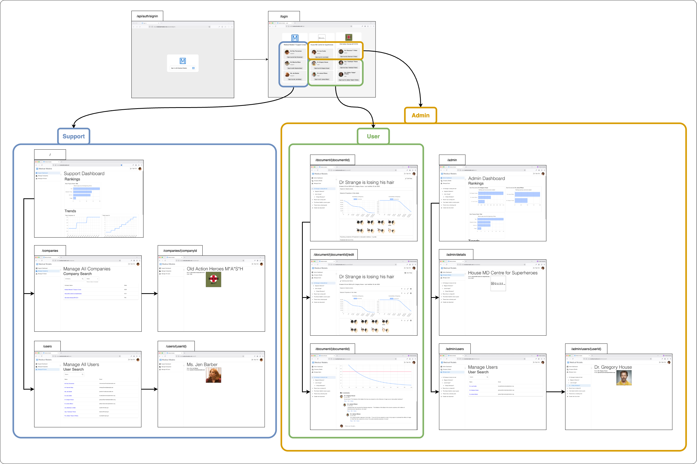
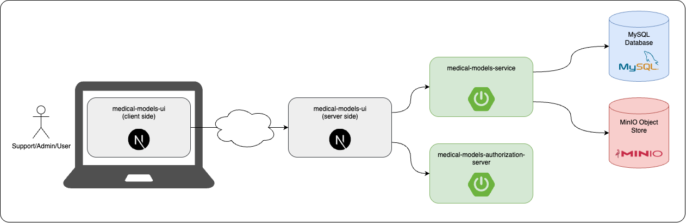
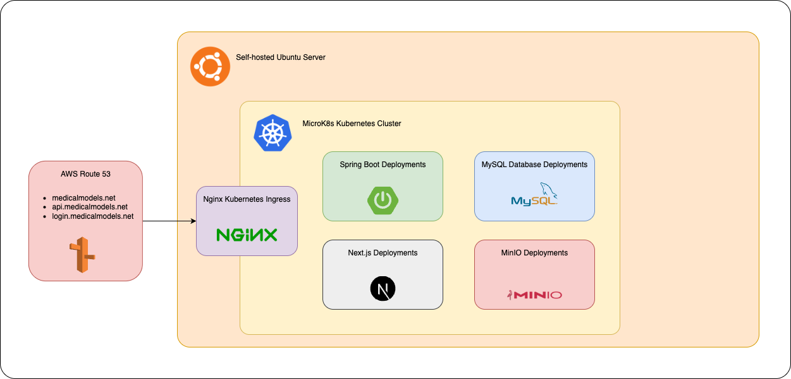
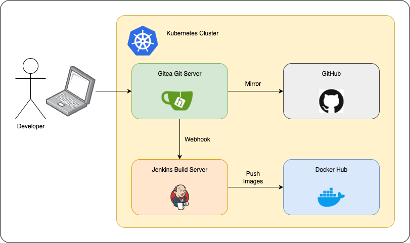

# Medical Models System Documentation

This repo contains the high-level system documentation for Medical Models. Explore the docs for each service in their repo:

| Service                                       | Repo                                                                                                                           |
|-----------------------------------------------|--------------------------------------------------------------------------------------------------------------------------------|
| Medical Models User Interface                 | [medical-models-ui](https://github.com/Medical-Models-Jonathon-Clifford/medical-models-ui)                                     |
| Medical Models Service                        | [medical-models-service](https://github.com/Medical-Models-Jonathon-Clifford/medical-models-service)                           |
| Medical Models OAuth 2.0 Authorization Server | [medical-models-authorization-server](https://github.com/Medical-Models-Jonathon-Clifford/medical-models-authorization-server) |

## Functionality

Medical Models is a demo application. With it, you can write documents and integrate biomedical computer models. It is designed to be collaborative. Users can comment on and edit each other's documents. Admins can manage their companies. Support personnel can manage the system.

The book [Computational Modeling in Biomedical Engineering and Medical Physics](https://www.amazon.com.au/Computational-Modeling-Biomedical-Engineering-Medical/dp/0128178973) by Alexandru Morega, Mihaela Morega and Alin Dobre inspired this application.

The Dielectric properties of body tissues model is based on the work described in the [Internet resource for the calculation of the Dielectric Properties of Body Tissues](http://niremf.ifac.cnr.it/tissprop/) by the Italian National Research Council.

The user experience takes inspiration from applications like Google Docs, Microsoft OneDrive, Atlassian Confluence and Canva.

## Page Structure

## Roles

| Role    | Description                                                                                                        |
|---------|--------------------------------------------------------------------------------------------------------------------|
| Support | (Theoretical) employee of Medical Models that manages companies and users. Can view important system-wide metrics. |
| Admin   | Administers a (theoretical) company's users. Can do everything a user can.                                         |
| User    | View, edit and comment on documents within their company.                                                          |

## Code
### High-level Architecture

At a high-level the architecture includes:
1. medical-models-ui - Since this is a Next.js app, part runs on the client and part on the server.
2. medical-models-service
3. medical-models-authorization-server
4. MySQL Database
5. MinIO Object store

## Platform
### Architecture

- A self-hosted server is running Ubuntu.
- Kubernetes is installed using MicroK8s.
- Route53 routes traffic from public domain names to the Kubernetes ingress.
- The Nginx Kubernetes ingress routes traffic to each service.
- Spring Boot, Next.js, MySQL and MinIO deployments all run on Kubernetes.

## Build and Deploy
### Pipeline

1. A developer pushes their code to Gitea.
2. Gitea calls a webhook on Jenkins.
3. Jenkins starts a build on the latest code.
4. If the build passes, Jenkins pushes the code to Docker Hub.
5. If the push succeeds, Jenkins deploys the new build to the Medical Models environment.

## Tooling

| Tool       | Notes                                                                | Docs                                     |
|------------|----------------------------------------------------------------------|------------------------------------------|
| Docker     | Most popular option for containerising applications.                 | https://docs.docker.com/manuals/         |
| Ubuntu     | Open source distribution of Linux. Well suited to running servers.   | https://documentation.ubuntu.com/server/ |
| Kubernetes | Leading container orchestration platform.                            | https://kubernetes.io/docs/home/         |
| MicroK8s   | Simple Kubernetes distribution from Canonical. Works well on Ubuntu. | https://microk8s.io/docs                 |
| Jenkins    | Open source build server with a large library of plugins.            | https://www.jenkins.io/doc/book/         |
| Gitea      | Simple, open source git server. Has a GitHub look and feel.          | https://docs.gitea.com/                  |
